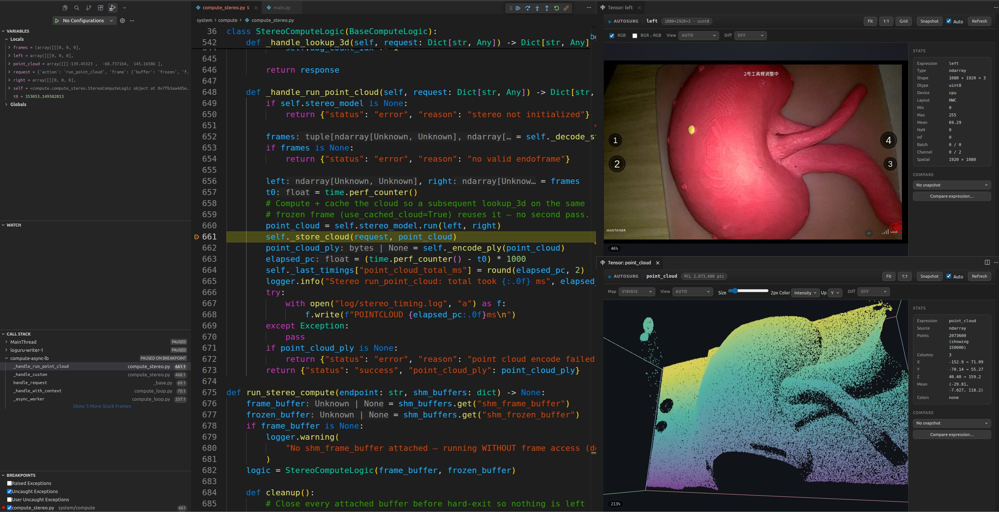

# AutoSurg Debug

**English** | [简体中文](README.zh-cn.md)

AutoSurg Debug is a VS Code / Cursor extension for managing and debugging AutoSurg Compute modules and the Orchestrator.

## Features

- Reads the module manifest from `system/config/modules.yaml`
- Shows Compute, Orchestrator, and infrastructure modules in a sidebar view
- Displays module runtime status and Compute replica counts
- Start, stop, and restart modules
- Green **Hot-Attach**: hot-inject debugpy into a running Compute or Orchestrator while keeping process state
- Orange **Restart-Attach**: restart a Compute, then attach (clears init state)
- Attach to all enabled Compute modules at once
- One-click debugging of the full system: Orchestrator in the main process plus all Compute modules
- One-click Orchestrator debug session (launches `main.py` when the system is not running)
- Automatic allocation of free debugpy ports
- Checks YAML syntax, duplicate keys, dependency references, and path presets
- Right-click Tensor / Mat image inspection while paused at a breakpoint, with slicing, pseudo-color, and a pixel probe
- Interactive 3D point cloud viewer: `.ply` files, `(N, 2..7)` tensors, and Open3D / trimesh clouds, with a force-cloud command
- Live system log tail (`AutoSurg: Show System Log Stream`) with backfill, auto-reconnect, and `rid=` request correlation
- Monitor dashboard: live stream/module telemetry plus a cross-process watch list of arbitrary expressions captured whenever any attached process pauses
- 3D point cloud viewer (WebGL): auto-detects `(N, 3..7)` tensors, Open3D / trimesh clouds, and `.ply` files, with orbit camera, RGB/intensity/height coloring, and point picking

Debug ports are preferredly hot-injected into running workers or the `main.py` process via ControlPlane `start_debug`; no `AUTOSURG_DEBUG_PORT` configuration is needed in `modules.yaml`. Each Compute row in the sidebar has two debug buttons: the green plug is Hot-Attach, the orange cycle arrow is Restart-Attach. Orchestrator rows also have a green Hot-Attach; since all Orchestrators share the single `main.py` process, only one main-process debug session is created.

## Installation

Open the Command Palette in VS Code or Cursor and run:

`Extensions: Install from VSIX...`

Pick the generated `autosurg-debug-*.vsix` file, then run:

`Developer: Reload Window`

## Prerequisites

- The workspace contains `system/config/modules.yaml`, or `autosurg.configPath` is configured
- AutoSurg uses a recent ControlPlane that supports `start_debug` hot-attach
- `autosurg.controlPython` points to a Python with `pyzmq` installed
- `debugpy` is importable in the target Compute environment; the worker tries to install it automatically when missing
- The Python debugging extension is installed in VS Code/Cursor

## Debugging a Compute Module

1. Set breakpoints in the target Compute code.
2. Start AutoSurg normally from the command line:

   ```bash
   cd system
   python3 main.py
   ```

3. Open the AutoSurg view on the left.
4. Find the target Compute, e.g. `stereo`.
5. Two debug buttons appear on the right side of the module row:
   - **Green plug**: Hot-Attach, injects into the running process without restarting or losing state. The module must already be running.
   - **Orange cycle arrow**: Restart-Attach, restarts the module with debug environment variables and then attaches; in-process state is cleared.

You can also right-click and choose `AutoSurg: Hot-Attach Compute` / `AutoSurg: Restart-Attach Compute`.

## Debugging All Compute Modules

Keep `main.py` running in the terminal, then run from the Command Palette:

`AutoSurg: Debug All Compute Modules`

The extension hot-attaches and attaches to each enabled Compute in turn. Every Compute uses its own debug port and its own call stack. Modules that are not running are still launched via their original path.

## Debugging the Full System

Full-system debugging covers all Orchestrators inside `main.py` plus every enabled Compute module.

1. Stop any `main.py` already running in the terminal.
2. Click the Debug Full System button at the top of the AutoSurg module view, or run:

   `AutoSurg: Debug Full System`

3. The extension launches `main.py` in debug mode.
4. Once ControlPlane is ready, the extension hot-attaches and attaches to each Compute in turn (no extra restarts for debugging).

While a breakpoint pauses a Compute, that module cannot serve RPC requests, and dependent business calls may time out. When debugging GPU modules, the initial model load may still take a while.

## Debugging an Orchestrator

Orchestrators and the Supervisor run inside the same `main.py` process. Hot-Attaching to any Orchestrator calls `debugpy.listen()` inside that process (conventional port 5684) and then attaches the debugger; breakpoints in other Orchestrators hit the same session.

1. Start AutoSurg normally from the command line:

   ```bash
   cd system
   python3 main.py
   ```

2. Set breakpoints in the target Orchestrator code.
3. Open the AutoSurg view on the left, find the target Orchestrator, and click the green **Hot-Attach**.

You can also right-click and choose `AutoSurg: Hot-Attach`. Clicking other Orchestrators again will not open a second session.

When the system is not running yet, you can still use `AutoSurg: Debug Orchestrator` to launch `main.py` in debug mode. If the main process is already under an F5 / Full System session, the extension reuses that session instead of attaching again.

A paused breakpoint freezes the entire main process (all Orchestrators, Gateway, ControlPlane), and dependent business calls may time out.

## Viewing Tensors / Mats While Debugging

**Example — see the current camera frame and the live point cloud at one
breakpoint:**



1. Attach the compute process (single-module debug or Multi-Attach) and pause
   on the line of interest — in this screenshot `_handle_run_point_cloud`
   just decoded the stereo frames and computed `point_cloud`.
2. Image: click the eye icon on `left` / `right` in Variables (or hover, or
   run *View Tensor…*). The panel shows the `(H, W, 3) uint8` frame with
   RGB/BGR→RGB, batch/channel sliders and a zoom HUD; the header chip prints
   `1080×1920×3 · uint8`.
3. Point cloud: right-click `point_cloud` → *View as Point Cloud (force)* on
   the second panel — the chip reports `PCL 2,073,600 pts` after
   downsampling; adjust point size, colouring (intensity/viridis here), up
   axis and rotation freely.
4. The Stats card tracks dtype/shape/min/max/mean/NaN live; use *Snapshot* +
   Compare to diff two frames of the same expression.

After a breakpoint pauses execution, you can visually inspect `torch.Tensor`, `numpy.ndarray`, PIL images, OpenCV images, and C++ `cv::Mat`.

1. Right-click a variable in the Variables or Watch pane and choose `View as Image / Tensor`.
2. Or select an expression in Python code and press `Ctrl+Alt+I` (`Cmd+Alt+I` on macOS).
3. The view supports wheel zoom, drag-to-pan, Fit / 1:1, Batch/Channel slicing, pseudo-color, and BGR/RGB toggle.
4. A pixel grid appears above 400% zoom; hovering shows coordinates and raw values.
5. Auto-refresh is on by default: opened views refresh automatically after F10 / F11 steps.
6. Hovering a tensor/image variable in code shows a mini thumbnail; click the link in the hover to open the full view.
7. Multi-channel tensors can be tiled via `Grid`; click a thumbnail to enter that channel.
8. `Snapshot` saves the current frame; Diff supports side-by-side or residual heatmap, and can also compare against another expression.

Data is encoded to PNG inside the debugged process memory and streamed to the webview over DAP—no temporary files are written.

Hover thumbnails can be disabled with the `autosurg.tensorHover` setting.

## Viewing Point Clouds

Arrays with shape `(N, 3)` … `(N, 7)` (xyz, optional intensity or RGB), Open3D / trimesh point clouds, and `.ply` files are rendered as interactive 3D point clouds in the same viewer:

1. Right-click a point-cloud variable while paused and choose `View as Image / Tensor`, force point-cloud rendering with `AutoSurg: View as Point Cloud (Force)` (Variables / Watch / selected code), or open a `.ply` file with `AutoSurg: Open Point Cloud (PLY)...` (also available from the Explorer right-click menu).
2. Drag to orbit, Shift+drag (or middle-drag) to pan, wheel to zoom, `Fit` to re-center.
3. `Color`: Auto / Gray / Intensity / RGB / Height colormap; `Up`: choose the Z / Y / X up axis; `Size`: point size in pixels.
4. Hover a point to see its index, coordinates, and color/intensity.
5. Auto-detection is a heuristic. Whenever a variable opens as an image/heatmap but you know it is a cloud, use the `View` selector in the viewer toolbar (`Auto` / `Image` / `Point Cloud`) — the forced path also accepts `(3, N)` transposed, `(B, N, C)` batched, and `(N, 2)` planar layouts that auto-detection ignores.

Clouds larger than 150k points are uniformly downsampled for transfer; statistics in the sidebar always report the full cloud. PLY support covers ASCII, binary_little_endian, and binary_big_endian files with `x/y/z`, optional `red/green/blue` and `intensity` properties.

## Monitor Dashboard

`AutoSurg: Open Monitor Panel` (dashboard icon in the sidebar title) opens a
general-purpose watch dashboard:

- **Streams · live** — fps (with sparkline), frame number, and network latency per image stream, polled from the system WebUI every ~2.5 s. No debugger required.
- **Modules** — running / restarting / stopped chips for every module at a glance.
- **Watches** — click **+ Watch expression**, pick the target process (Orchestrator or any attached Compute) and type any expression: `tracker.pose`, `last_depths.mean()`, `len(pending_tasks)`. Because the Debug Adapter Protocol can only evaluate while a process is stopped, **values are captured whenever that process pauses** (breakpoint hit, step, or pause); each row shows the value, target, and its age. A 10 M-element tensor is subsampled; broken `__repr__` objects cannot hang the board.
- **Recent events** — module lifecycle events (started / crashed / restarted) from the system event bus.

Want continuously-live values for arbitrary expressions? That requires a tiny
read-only evaluate action inside each worker (the protocol boundary is
fundamental, not an implementation shortcut) — see the system-side `watch`
action proposal discussed with the maintainers.

## System Log Stream

`AutoSurg: Show System Log Stream` tails the live log stream of the running
system over the WebUI WebSocket (port = ControlPlane − 8, i.e. **5552** by
default; override with `autosurg.webuiPort`). It first backfills up to 200
buffered lines, then follows live and reconnects automatically with backoff.
Each line shows time, level, origin and — when present — the
`rid=<request-id>` that ties the gateway → orchestrator → compute log lines
of one business request together, which makes cross-module debugging
traceable end to end.

By default the stream renders in a **terminal** (a processless pseudoterminal)
so it can show colors: levels, timestamps and origins follow Loguru's default
palette (`autosurg.logView = terminal`). VS Code Output channels can never
render ANSI colors, so pick `output` (plain text) or `both` for the classic
panel if you prefer its search UI. Escape sequences from the stream are
sanitized: color codes pass through, everything else (cursor/alt-screen/OSC
control sequences) is stripped, so a hostile log line cannot paint your
prompt. Closing the log terminal disconnects the stream; run the command
again to reconnect.

## Validating Configuration

Click the validate button at the top of the AutoSurg module view, or run:

`AutoSurg: Validate Configuration`

Results are shown in the editor's Problems pane.

## Extension Settings

- `autosurg.configPath`: path to `modules.yaml`; relative paths resolve against the workspace root
- `autosurg.controlHost`: ControlPlane address, defaults to `localhost`
- `autosurg.controlPython`: Python used to run the ControlPlane client, defaults to `python3`
- `autosurg.debugPortBase`: first port tried when auto-assigning debug ports, defaults to `5678`
- `autosurg.tensorHover`: show tensor thumbnails on hover while the debugger is paused, on by default

## Troubleshooting

### Module status is unavailable

Make sure `main.py` is running and that the environment pointed to by `autosurg.controlPython` has `pyzmq` installed.

### A module never becomes ready while debugging

Check `system/log/latest_log.log` for startup errors of the target worker. Common causes include a wrong Python environment, missing CUDA libraries, or `debugpy` failing to import.

### Business requests time out while debugging

Business requests can be sent right after a successful hot-attach. If the program is stopped at a breakpoint, that Compute's RPC calls will wait and may trigger client-side timeouts.

### Hot-attach failed and the module was restarted

When an old ControlPlane lacks `start_debug`, the worker has not loaded the new code, or the conventional debug port is occupied, the extension falls back to the restart path. Confirm that `main.py` with `start_debug` has been restarted, and check that ports 5678–5683 are free.

## Author

Zacario Li  
<zacario.li@outlook.com>

## License

MIT
